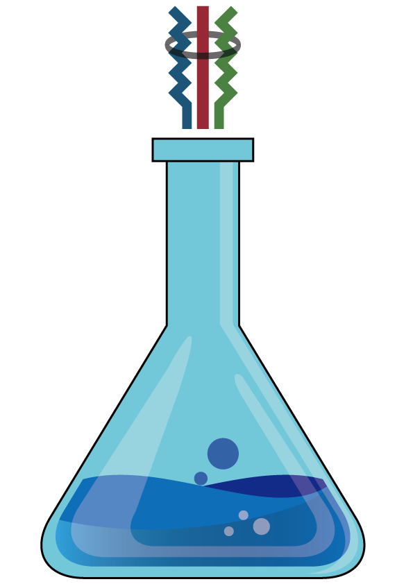

# CodeAlchemist

CodeAlchemist is a JavaScript engine fuzzer that improves classic grammar-based
JS engine fuzzers by a novel test case generation algorithm, called
semantics-aware assembly. The details of the algorithm is in our
[paper](https://daramg.gift/paper/han-ndss2019.pdf), "CodeAlchemist:
Semantics-Aware Code Generation to Find Vulnerabilities in JavaScript Engines",
which appeared in NDSS 2019. This is a stable version of CodeAlchemist and it
currently supports ChakraCore, V8, SpiderMonkey, and JavaScriptCore.

# Installation

CodeAlchemist currently works on only Linux and we tested on Ubuntu 18.04.

1. Install dependencies (`build-essential`, `nodejs`, `npm`, `esprima`, `dotnet`)
```
$ sudo apt update
$ sudo apt install build-essential
$ sudo apt install nodejs npm
$ npm i esprima@4.0.1
```
Installation for `dotnet` depends on OS version, so please refer this [link](https://dotnet.microsoft.com/download/linux-package-manager/ubuntu18-04/sdk-current).

2. Clone and build `CodeAlchemist`
```
$ git clone https://github.com/SoftSec-KAIST/CodeAlchemist
$ cd CodeAlchemist
$ make
```

# Usage

1. Prepare to start

Prepare JS seed files, a configuration file, and the requirements in the
configuration. Please refer [conf/README.md](conf/README.md) for writing the
configuration file.

2. Preprocess JS seed files
```
$ dotnet bin/Main.dll rewrite <conf ABSPATH>
$ dotnet bin/Main.dll instrument <conf ABSPATH>
```

3. Run fuzzing process
```
$ dotnet bin/Main.dll fuzz <conf ABSPATH>
```
There are four optional parameters for our JS code generation algorithm.
- `iMax` (default: 8): The maximum number of iterations of the generation
  algorithm.
- `pBlk` (default: 16): The probability of reinventing block statements.
- `iBlk` (default: 3): The maximum number of iteration for generating a block
  statement.
- `dMax` (default: 3): The maximum nesting level for a reassembling block
  statement.

You can specify parameters with following commands.
```
$ dotnet bin/Main.dll fuzz <conf ABSPATH> --iMax 8 --pBlk 16 --iBlk 3 --dMax 3
```

# CVEs ([Credits](./docs/CVE.md))
If you find bugs and get CVEs by running CodeAlchemist, please let us know
by sending a PR for [./docs/CVE.md](./docs/CVE.md).

- JavaScriptCore: CVE-2018-4464, CVE-2018-4437, CVE-2018-4378, CVE-2018-4372

# Authors
This research project has been conducted by [SoftSec Lab](https://softsec.kaist.ac.kr) at KAIST.
* [HyungSeok Han](http://daramg.gift/)
* [DongHyeon Oh](https://zanywhale.com/)
* [Sang Kil Cha](https://softsec.kaist.ac.kr/~sangkilc/)


# Citation
If you plan to use CodeAlchemist in your own research. Please consider citing
our [paper](https://daramg.gift/paper/han-ndss2019.pdf):
```
@INPROCEEDINGS{han:ndss:2019,
  author = {HyungSeok Han and DongHyeon Oh and Sang Kil Cha},
  title = {{CodeAlchemist}: Semantics-Aware Code Generation to Find Vulnerabilities in JavaScript Engines},
  booktitle = ndss,
  year = 2019
}
```
